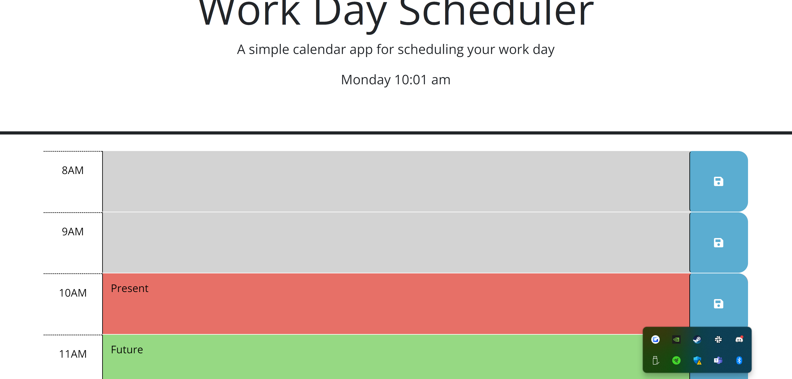

## Daily Tracker

# Description

A simple web app to help schedule your day. It features regular buisness hours (8AM-5PM) and past hours will be disabled, where as the current and future hours will display with corresponding colors.

# Acceptance Criteria

* Current day & time displayed at the top
* Include timeblocks for standard business hours
* Color coded to indicate past, present and future hours
* Area to write for scheduling & save button
* Saved data presists when reloaded

# Link

https://nicholewilburn.github.io/Daily-Tracker/

# Screenshot

# Credits

UOFM - Starter Code

# Liscense

None
